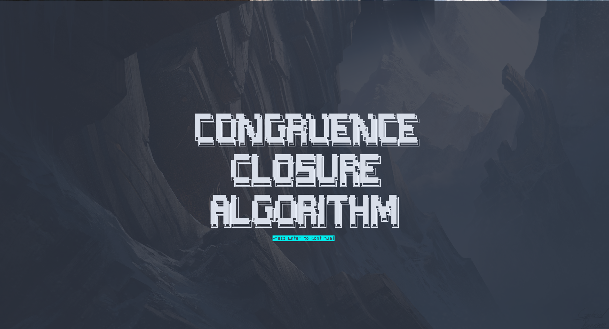
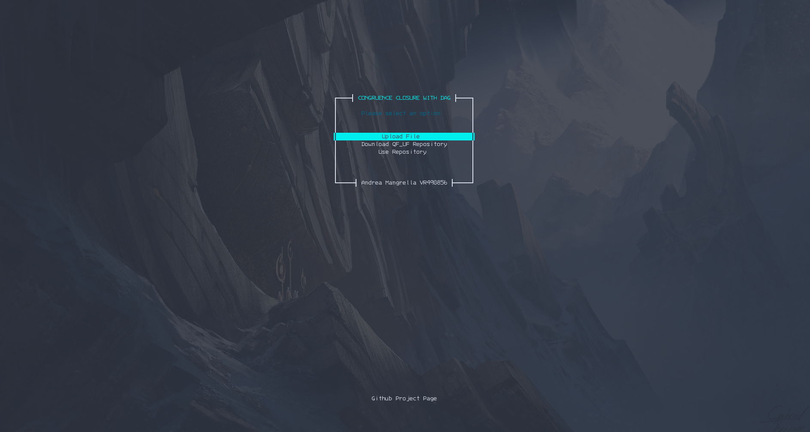

## Congruence Closure with DAG's 

Start Page | Main Menu  
:-------------------------:|:-------------------------:
    |   


Project for the Automated reasoning course (22-23). 
Implementation of the Congruence Closure algorithm, that is an important method used in automated
reasoning and symbolic computation to reason and solve equations and inequalities involving congruence relations.

### CLI: 
The CLI installation script will create a virtual environment with venv and then run the script on all the inputs I provided for this project.
To run the CLI version simply run: 
```
cd deps
bash installer.sh
```

### TUI: 
Otherwise to use the TUI install the dependencies and run the program by typing:  
```
pip install -r ./deps/requirements.txt
python3 blessed_tui.py
```


### TODO:
- [x] Finish creation of the graph
- [x] Fix CC_DAG 
- [x] Fix smt file atom parsing  
- [x] Simplify Input Formulas
- [ ] Add DNF parser 
